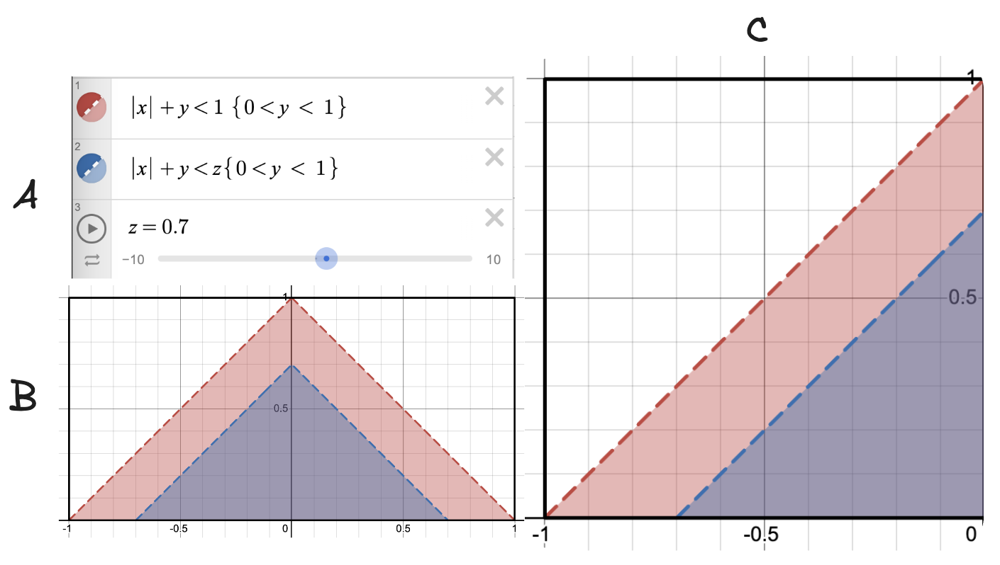

# Problem

Suppose $(X, Y)$ is uniformly distributed over the region 

```math
\left\{(x, y) \in \mathbb{R}^2 : 0 < y < 1, |x| < 1 - y \right\}
```

Calculate the p.d.f. of $|X|+Y$.

# Solution

* A natural question is where did $|X|+Y$ come from suddenly? Then, naturally your observation goes to the region ($R$ let's say)
```math
R = \left\{(x, y) \in \mathbb{R}^2 : 0 < y < 1, |x| < 1 - y \right\} = \left\{(x, y) \in \mathbb{R}^2 : 0 < y < 1, |x| + y< 1 \right\}
```
* Let's call $|X|+Y = Z$. Obsreve that $0 < Z < 1$. Thus, we want to find the cumulative distribution function of $Z$ i.e. $P(Z \leq z)$, where $0 < z < 1$. To remind you, finding the range of a transformed random variable is extremely important in multivariate random variables problems due to the convoluted interdependence of random variables.
* **Technique Alert!**: Whenever a problem is given with uniform distribution over a region (mostly in 1D, 2D, 3D space), the first step should be to always to project the problem in a geometric probability sense. This is due to the fact that if (let's say in 2D) if $X$ is uniform in a space $\Delta$, then $P(X \in A)$ is same as $\frac{\text{Area}(A)}{\text{Area}(\Delta)}$ i.e. the probability is proportional to the area of the space. In case of 1D, it will be length, and in 3D it will be volume.
* Using this technique, we will not understand and draw the 2D region of the domain of $(X,Y)$ that is the region $R$.
* The issue is the $|X|$, so we will try to break it up into pieces where the equation becomes linear, and divide the region into disjoint negative and non-negative $x$ regions.

```math
\left\{(x, y) \in \mathbb{R}^2 : 0 < y < 1, |x| < 1 - y \right\} = \left\{(x, y) \in \mathbb{R}^2 : 0 \leq x < 1, 0 < y < 1, x + y < 1 \right\} \cup \left\{(x, y) \in \mathbb{R}^2 : -1 < x < 0, 0 < y < 1, y - x < 1 \right\} 
```
* Let's draw the picture of the region right now.

<div align="center">
  
</div>

* Image A, and B shows the equations and region $R$ (red), where $(X,Y)$ is restricted to. The blue region in the image corresponds to $P(Z 
\leq z)$ for $0 < z < 1$. This is because both the linear regions accordingly get scaled.

* The image C proves that by similarity of triangles for both the negative and non-negative x, that $P(Z \leq z) = \frac{P((X,Y) \in \text{Blue})}{P((X,Y) \in \text{Red})} = \frac{\text{Area}(\text{Blue})}{\text{Area}(\text{Red})} = \frac{z^2}{1}$. Hence $F_Z(z) = z^2 \implies f_Z(z) = 2z; 0 < z < 1$.  

